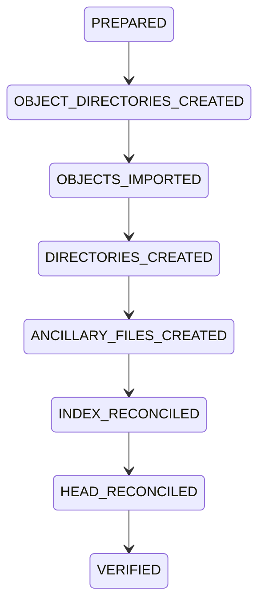

# Stage 0.33C runtime-baseline reconciliation — additive proposal

**Status: PROPOSAL ONLY — NOT APPROVED, NOT PUBLISHED, NO EXECUTION AUTHORITY.**

Prepared at 2026-09-29T21:29:26.550571Z. Owner authorizes governance-only preparation. No commit,
merge, source synchronization, reset, checkout, clean, restart, installation,
selector, recovery activation or authority consumption is performed or granted.
Mode: `solo-project-owner-bootstrap`; one accountable Owner, AI assistance advisory,
no independent-human acceptance. This is not a production-risk waiver.

## Decision proposed

Advance the runtime source Git baseline, under a later separately reviewed and
authorized reconciliation procedure, from `b5fa2acaa66db799ebd8ec03d2a06a04e34753a2` to the already merged PR #306
commit `efe859b2ae74b339c93fb3d6986ac6f2407a154c`. Keep the deployed authentication modules byte- and inode-identical.
The target is fixed; it is not a moving `main` reference. Current main is `e94de11aaedc6695370306668c844db615f03c4e`.
PR #306's reviewed HEAD is `b1c4017378f32038a79d6fb88b1f0e65709b34d6`.

Choose PR #306's merge rather than current main: it is the earliest named deployment
baseline in this proposal, has the exact running application bytes, and the complete
tree delta from the current pin is only five files. Later main has identical application
content but additional governance history need not be installed into runtime. Later
governance/evidence objects can be retained separately without advancing runtime again.

Advancing Git is the correct source-state reconciliation **but is insufficient for
recovery authority**. The current PR #304 evidence still binds `b5fa2acaa66db799ebd8ec03d2a06a04e34753a2`. The unchanged
reader requires exact live HEAD/evidence/activation equality AND full Git cleanliness.
A new additive binding authority and successor evidence are required. Do not bypass
the gate with ignored/untracked exclusions, assume-unchanged flags, a synthetic clean
index, a source-path switch, or an amended historical record. Source cleanliness does
not establish recovery readiness.

## Exact observed baseline

Runtime path `/opt/aios-src`; HEAD detached at `b5fa2acaa66db799ebd8ec03d2a06a04e34753a2`. Exact status:

```text
 M core/adapters/telegram/main.py
?? core/adapters/telegram/auth_evidence.py
```

| File | Current SHA-256 | Git status |
|---|---|---|
| `/opt/aios-src/core/adapters/telegram/main.py` | `ed57cb64c076cfbbb54132c6f603dcc301d30fb7ebfee254ae2c463f849341b6` | tracked modified; +5 lines |
| `/opt/aios-src/core/adapters/telegram/auth_evidence.py` | `aa01ffc14ef040bbe80467b3f6b0987a89484abeb9078f6fdf31d100d692d995` | untracked at current HEAD |

Both modules equal reviewed PR #306, its merge, retained deployment copies, and
current main. All 92 files compared under `core`, `config`, `deploy`, `migrations`
and `requirements.txt` equal the proposed target and current main. This is verified
source compatibility, not blanket approval of an entire runtime environment.

Deployment evidence: `/home/aiosadmin/aios-deployment-receipts/pr306-efe859b2/receipt.json`,
SHA-256 `da15d96d01d2a9bfe75e032da093b50366a1837ccc24b744dbc8d806d34940d8`. It records deployment at
2026-09-27T22:23:46.475412+00:00 and a failed initial restart command. Current service
startup corroborates a later running process; do not invent a successful original
restart receipt or retroactive deployment authorization.

Service unit `/etc/systemd/system/aios.service`, SHA-256 `02c4d1ee313b3129b425f3884d794044b3f21916d4ddb9bcfc9c9f8ca2d01281`.
No drop-ins observed. WorkingDirectory `/opt/aios-src`; ExecStart
`/opt/aios/runtime/venv/bin/python -m core.adapters.telegram.main`; User/Group
`aiosadmin`; executable resolves to `/usr/bin/python3.12`. Runtime environment
file `/opt/aios/runtime/config/runtime.env` is hash/identity-bound in the companion
snapshot without copying its secret content. No unit, environment, interpreter,
dependencies, process, or service-state change is proposed. Existing process origin
and cached code support the source mapping; live Python memory was not inspected.

## Minimal additive governance mechanism

1. Independently review this scoped addendum under the applicable role model, obtain
   explicit Owner approval and separate publication authority, publish and verify it.
   Approval may establish permission to PREPARE the later migration and binding only;
   it must not silently turn proposal review into runtime execution authorization.
2. Issue a new authenticated serial Owner `authorize-binding` decision after sequence
   4, naming this exact target, immediate evidence predecessor and published addendum.
   Sequence 5 is only the next available number if rechecked then; no ID, timestamp,
   approval, digest, reservation, future merge or effective authority is invented here.
   In solo mode its effect must explicitly withhold production execution. A separate
   `supersede` decision is needed only if later review identifies a live conflicting
   authority; no such conflict is silently assumed or reconciled here.
3. Separately authorize the exact source-reconciliation procedure. Apply the process
   high-risk production boundary and action-specific human acceptance/risk amendment
   wherever required. Neither this addendum nor bootstrap closure supplies that gate.
4. After actual reconciliation and authenticated clean-state verification, separately
   authorize population of ONE new successor under the existing closed
   `aios-p4s7-recovery-review-merge-evidence-v1` schema. New `binding_id` is allocated
   at that later step. `expected_runtime_head` becomes `efe859b2ae74b339c93fb3d6986ac6f2407a154c`. All other fixed
   authority/approval/package/executor/policy and component review identities remain
   the existing exact values. No reader or schema amendment appears necessary from
   static inspection; later isolated verification must confirm all chain checks.
5. The successor's exact `supersedes` is:

```json
{
  "kind": "recovery-evidence-v1",
  "commit": "d49f2cc3228ec85ae79f6648467c3709726b1327",
  "path": "docs/intelligence/stage-0.33c-p4s7-recovery-review-merge-evidence/records/1b8e3152-e315-43f4-9396-28776bd87947.json",
  "transport_sha256": "11a609eaf580d3283b84d4994fb7f79a2995da6bab529ca722032f69c98523b2"
}
```

This is a normal successor of PR #304, not a second first-record entitlement or a
reopened bootstrap. Do not skip PR #304 or replace its R34 predecessor. Publish the
later evidence through its own two-parent review/merge/verification lifecycle;
the evidence namespace diff must be its unique new record as required by the reader.
It must descend from the target runtime and the applicable amendment lineage.
6. Any later selector decision/publication and activation remain separately governed.
   The selector is presently absent. There is no reason to publish the old PR #304
   selector solely to manufacture a transition: later reviewed authority must name
   the exact verified successor and preserve its complete chain. Until an authorized
   selector is published and verified, R34 remains the operational authority baseline.

This addendum supplies only the proposed limited departure from PR #303's frozen
first-record runtime binding for a NEW successor and source reconciliation. PR #303,
PR #304, R34, decisions 1–4, all approvals and historic timestamps remain immutable.

## Affected bindings and preserved values

| Binding | Proposal |
|---|---|
| Actual runtime Git HEAD | Later move detached HEAD from `b5fa2acaa66db799ebd8ec03d2a06a04e34753a2` to `efe859b2ae74b339c93fb3d6986ac6f2407a154c` |
| PR #304 `expected_runtime_head` | Preserve `b5fa2acaa66db799ebd8ec03d2a06a04e34753a2` forever in that record |
| New successor `expected_runtime_head` | `efe859b2ae74b339c93fb3d6986ac6f2407a154c` only after separately verified reconciliation |
| New successor predecessor | Exact PR #304 GitRef above |
| Reader | PR #302; reviewed `f379a15eb5f64b5b5a6ffd7cb7ca0d27c847e368`; merge `b5fa2acaa66db799ebd8ec03d2a06a04e34753a2`; unchanged |
| `authority_id` | `7bc638e2-e1f4-4e87-a54a-4d0df031b130`; no renewal |
| `approval_id` | `3a478d87-5c4f-4778-9f88-2228f4d7167f`; no renewal |
| `package_payload_sha256` | `be7a1750eb77ae77e8f020fc3f29c5f047cf88d1720a387f50f58f58c877962e`; unchanged |
| Later activation | Must bind the actually selected new evidence and exact new HEAD; create only under separate authority |
| Selector | Preserve absence now; later publication requires separate decision/procedure |
| Existing approval window | 2026-09-26T23:24:12.093093Z through, excluding, 2026-10-03T23:24:12.093093Z; never extended/reserved by this proposal |

The following bytes match current runtime, old HEAD, proposed target and current main:

| Preserved artifact | SHA-256 |
|---|---|
| `docs/intelligence/stage-0.33c-step4-one-shot-runtime-install-authority/one_shot_install.py` | `7b38ce601cbeb930a4277af8f4dfe66bbf4b7b9df9ad94059e504082f58a8beb` |
| `docs/intelligence/stage-0.33c-step4-one-shot-runtime-install-authority/00_ONE_SHOT_RUNTIME_INSTALLATION_AUTHORITY.md` | `39b0768d989c89fa64c6593834220f9846c6013e7e10c03ec5eec34cd78098c0` |
| `docs/intelligence/stage-0.33c-p4s7-recovery-activation/00_RECOVERY_ACTIVATION_GOVERNANCE.md` | `299296d106d6d661ac2fd55b1442b9980485d7f2bdf64b228fbfebbbb73dcf31` |
| `docs/intelligence/stage-0.33c-p4s7-recovery-review-merge-evidence/00_RECOVERY_REVIEW_MERGE_EVIDENCE_CONTRACT.md` | `7b9e5ee9daf7b9ffe387b63ebff6629d97546a27eb0f5207271ac5ec1fb9f957` |

## Later migration plan — not executable authority

The following is a bounded protocol specification for a future separately reviewed
implementation. This revision creates no operation directory, ledger, backup, Git
object, runtime file or lock. It grants no execution authority. Apply the already
stated governance, action-specific acceptance and currentness gates before any step.

### M1: complete, closed creation allowlist

`01_CURRENT_BASELINE_BINDINGS.json.creation_allowlist` is the exhaustive path-level
allowlist. It enumerates all 62 object files, their Git type/length/OID/raw SHA-256,
all three ancillary files and hashes, exact child basenames per parent, baseline
parent identities, and both metadata transactions. No arbitrary parent creation,
recursive mkdir, path discovery or extra temporary runtime paths is allowed.

All new runtime entries are owned by `aiosadmin:aiosadmin` (UID/GID 1000/1000).
Existing parent owners/modes/inodes stay unchanged. New directories are ordinary
0755 directories; ancillary files are ordinary 0644 files (Git 100644); loose Git
objects are ordinary 0444 files. No symlinks, devices, sockets or gitlinks.

| Exact directory | Create? | Exact allowed new children | Rollback |
|---|---|---|---|
| `/opt/aios-src/docs/governance` | No; existing pinned 0775 parent | `TELEGRAM_AUTH_EVIDENCE_RETENTION.md` | Quarantine only that proven-created file |
| `/opt/aios-src/docs/intelligence/stage-0.33c-p4s7-recovery-binding-supersession` | Yes; missing 0755 directory under existing `/opt/aios-src/docs/intelligence` | `00_FIRST_RECOVERY_EVIDENCE_BINDING_AUTHORITY.md` | After child quarantine, quarantine the proven-created empty directory |
| `/opt/aios-src/tests/unit/core_platform` | No; existing pinned 0775 parent | `test_telegram_auth_evidence.py` | Quarantine only that proven-created file |
| `/opt/aios-src/.git/objects/{21,22,28,5e,60,86,87,c0,fa}` | Yes; these nine missing 0755 fanout directories only | Exact object basenames enumerated for each parent in JSON | Retain verified directories and objects; never prune |
| Other object fanout parents listed in JSON | No; existing identity-pinned parents | Only the enumerated missing object basenames | Preserve pre-existing entries and imported objects |

Brace notation above abbreviates exactly nine enumerated JSON paths, not a pattern
that delegates additional creation. Pin all existing ancestors, including
`/opt/aios-src/docs/intelligence` and `/opt/aios-src/.git/objects`, before starting.
New fanout directories must precede their child object imports; the new documentation
directory precedes its child. Create no other runtime directories.

Use descriptor-relative no-follow traversal. Reject symlinks at every component and
recheck parent dev/inode/uid/gid/mode before and after each mutation. Publish absent
paths only with a no-replace operation. If an absent directory/file already exists,
STOP unless durable records for THIS attempt identify the exact same created inode,
parent and completed operation; then verify it and resume without recreating it.
Matching bytes alone do not establish ownership. Do not chmod/adopt/replace an
unexpected existing directory, even if empty. Directory timestamps can change through
expected child operations; record them without confusing them with custody identity.

Stage new regular files in the external operation area, fsync them, record their
identities durably, then hardlink them exclusively to their allowed destination.
Keep the external anchor for provenance. Stage a new directory externally, record its
identity durably, then use same-filesystem no-replace rename to its allowed path.
If directory publication succeeds but child creation fails, its ledgered identity
supports the rollback disposition in the table. Empty/unproven directory is not
synonymous with safe to remove. All existing content is immutable.

### M2: exact external operation area and durable ledger

Fixed single-attempt root:
`/home/aiosadmin/aios-deployment-receipts/runtime-baseline-reconciliation-efe859b2`

- Ledger directory: `.../runtime-baseline-reconciliation-efe859b2/ledger`
- Backup parent: `.../runtime-baseline-reconciliation-efe859b2/backup`
- Quarantine parent: `.../runtime-baseline-reconciliation-efe859b2/quarantine`
- Staging parent: `.../runtime-baseline-reconciliation-efe859b2/staging`

Here `...` means exactly `/home/aiosadmin/aios-deployment-receipts`; JSON contains
all full absolute paths. The existing parent is pinned; the attempt root and four
subdirectories are currently absent. These five directories alone may be created,
exclusively, owned by UID/GID 1000/1000 with mode 0700. Never reuse an unexplained
existing attempt directory. A second attempt requires new reviewed paths and approval.
The entire area is outside `/opt/aios-src`, so rollback storage cannot dirty runtime.

The ledger consists of immutable canonical UTF-8 JSON event files:
`ledger/<ordinal:06d>-<operation_id>-<event>.json`, ordinary mode 0600. Allowed operation
IDs are the finite JSON inventory (`O001`–`O062`, `D001`–`D010`, `F001`–`F003`,
`M_INDEX`, `M_HEAD`, `PREPARE`, `VERIFY`, `ROLLBACK`, `FINAL`); event types are
`INTENT`, `STAGED`, `BEFORE`, `AFTER`, `DONE`, `STOP`. The ordinal is allocated
serially while holding flock on the pinned attempt-root directory descriptor (no new
lock file), in addition to the separately established exclusion of other Git writers; each event binds the prior event's SHA-256.
Use exclusive no-follow creation; no truncation, rewriting, deletion, renumbering or
replacement. A repeated state transition reads and validates the existing DONE event
rather than emitting a second mutation. No event is authority by itself.

Each event binds the actual UTC time, attempt root, operation/source/destination,
before and after dev/inode/type/uid/gid/mode/size/content hash, relevant Git OID, parent
identities, and observed durability checks. Before-state records distinguish absent
from existing explicitly. Per-operation AFTER and DONE are completion markers.
Write and fsync the complete intent event and ledger directory BEFORE side effects;
fsync staged files/parents before publication; fsync both namespace parents after
link/rename/exchange; re-open no-follow and compare exact identities/content; only
then durably record AFTER and DONE. A torn event is preserved and causes STOP, never
truncated or silently repaired. Future implementation must validate filesystem support
in a separate environment; no weaker primitive is silently substituted.

External artifact names are deterministic and finite: staging anchors and quarantine
paths are enumerated per operation in JSON. Object stages are `staging/O###.object`,
ancillary stages `staging/F###.file`, directory stages `staging/D###.directory`.
Ancillary quarantine is `quarantine/F###.file`; documentation-directory quarantine is
its exact `quarantine/D###.directory`. Events record actual identities, never just
these names. Existing stage/quarantine content is accepted only as a validated prior
state of this exact attempt; otherwise STOP. No unbounded temporary-file namespace.

### Preparation, operation order and Git metadata transaction

1. Recheck approved fixed baseline, exact two-entry status, unchanged target/source
   hashes, complete graph inventory, service, archive custody and all preconditions.
   Pin existing ancestors and verify runtime and external operation paths are on
   the same filesystem. Exclude all concurrent Git writers and recovery actions;
   do not restart or stop the service to obtain this exclusion. If exclusion cannot
   be established without service changes, STOP for a new plan.
2. Exclusively initialize the external area. Before PREPARED, write/fsync exclusive
   0600 `backup/HEAD.bytes`, `backup/index.bytes`, `backup/config.bytes`,
   `backup/logs-HEAD.bytes` and `backup/before-state.json`. Include original status,
   detached HEAD, exact index bytes/flags, service/custody identities and absent paths.
   Create `backup/HEAD.original` and `backup/index.original` as hardlinks to original
   metadata; preserve their existing 0664 modes, ownership, bytes and inodes inside
   0700 backup storage. Never chmod these anchors or mutate their contents. The
   intentional metadata nlink/ctime change from anchoring is logged; no application
   or authentication object is hardlinked or altered. Fsync backups and parents.
3. Prepare `staging/index.after` and `staging/HEAD.after` externally with exact final
   metadata bytes and mode 0664, owner 1000/1000. The future implementation must generate the index in a separately authorized
   development scratch repository, never via a production Git writer. That workspace
   is not part of this runtime mutation authority; prepare and approve the exact
   index artifact before execution. Compare against the unchanged target tree; compare its complete path/mode/
   blob inventory and flags, excluding ignore/skip-worktree/assume-unchanged shortcuts.
   Future execution approval must bind these generated metadata hashes. HEAD bytes
   are exactly the full target commit plus LF. Fsync, record identities/hashes, then
   seal PREPARED. No Git writer, installer or source import runs against production.
4. Publish the nine object fanout directories by their exact D operations and durably
   seal OBJECT_DIRECTORIES_CREATED. Import
   O operations in listed order using retained durable staging anchors and exclusive
   links. Objects contain zlib-compressed canonical Git headers and payloads; validate
   type/length/OID and raw SHA-256 after decompression. Verify the entire target graph.
   Never change refs or existing objects; no fetch/repack/GC. Seal OBJECTS_IMPORTED.
5. Publish only the new documentation directory, then F001–F003 ancillary files
   through the same intent/stage/publish/verify/DONE protocol. Do not overwrite either
   deployed module. Seal DIRECTORIES_CREATED and ANCILLARY_FILES_CREATED respectively.
6. Reconcile index first, then HEAD. For each, create the exact `.git/index.lock` or
   `.git/HEAD.lock` as an exclusive hardlink to its prepared-after anchor. Validate
   original live inode/bytes and candidate lock identity, persist BEFORE, and use
   `renameat2(RENAME_EXCHANGE)` on those two exact paths. This atomically swaps the
   prepared file into place and moves the original to the lock path. No in-place
   overwrite. Persist/fsync/reverify before advancing. Retain the original lock inode
   by no-replace rename into `quarantine/index.forward-old` or `HEAD.forward-old`;
   original backup anchors remain. A pre-existing foreign lock is STOP.
7. Seal INDEX_RECONCILED and then HEAD_RECONCILED only after each complete operation.
   Read-only full verification must show target detached HEAD, exact complete target
   index/worktree, empty staged/tracked/untracked status, original module bytes/inodes,
   unchanged service/PID/config/interpreter and authentication/rollback custody.
   Record actual results, then VERIFIED. No restart, selector, activation or install.
   Human adoption is a separate later gate; VERIFIED is technical, not authority.

Only live metadata paths `.git/index`, `.git/HEAD` and their two exact lock paths may
change. This design does not append or rewrite `.git/logs/HEAD`, change `.git/config`,
move branch refs, or run hooks/automatic maintenance. The immutable external ledger
records the metadata transition. Existing hardlink anchors retain original inode and
bytes for rollback; inode and byte preservation does NOT imply preservation of ctime
or nlink. Log real values without backdating. The proposed implementation must prove
exchange/no-replace durability and restart behavior before any execution approval.

### Migration state machine



The extra OBJECT_DIRECTORIES_CREATED state makes the required parent-before-object
ordering explicit. Every transition first validates the durable previous state,
per-operation ledger and actual paths. A completed matching transition is an idempotent
no-op. An interrupted transition resumes only from a proven identity state or follows
rollback. Unprovable identity or torn ledger means STOP; there is no guessed recovery.
Any nonterminal state may enter ROLLBACK_INTENT then ROLLED_BACK under the separately
approved rollback policy. VERIFIED and ROLLED_BACK are terminal: repeated inspection
verifies them, but never restarts forward mutation. A new attempt needs new authority.

### Exact later files and immutable boundaries

The JSON allowlists name exactly the previously proposed 62 Git object files, nine
needed fanout directories, one needed documentation directory, three ancillary files,
HEAD/index and their locks. The two application modules change Git classification only.
The newly specified external control artifacts are rollback infrastructure explicitly
requested by this revision, not a new deployment feature. No new application file,
configuration, service, database, dependency, selector or activation change is added.

Both deployed module bytes/inodes/ownership/modes; service unit/environment/venv;
executor/policy/reader/R34; authentication evidence including every journal, guard,
certificate, marker, consumed record and namespace identity; retained deployment
rollback copies; all historical Git objects, PR304, decisions 1–4 and receipts remain
immutable. Snapshot hashes/identities remain the before-state, not a grant to recreate
lost objects. Authentication namespaces are never staged, linked, copied back, moved,
fsynced by verifier helpers or consumed by migration. Unexpected concurrent application
archive writes cause STOP/recheck; they do not authorize the migration to repair them.

Later governance additions still require this reviewed amendment, a new serial Owner
binding-authority decision with its sources, and later a successor evidence record
with PR304 as immediate predecessor. Sequence 5 remains conditional and unallocated.
No machine-readable decision or successor is created by this revision.

## Deterministic rollback and partial-state recovery

Rollback requires the separately authorized rollback policy and a durable
ROLLBACK_INTENT event. No automatic recovery runs after an unclassified failure.
Validate all anchors, original hashes and namespace identities before each step.
A before-state exact match is an idempotent no-op; an after-state exact match is the
only permitted mutation case. A third state always causes STOP.

1. Restore original HEAD first if advanced, then original index. If HEAD never
   advanced, leave it alone. Resolve any lock only against its ledgered before/after
   inode; preserve or move proven-owned lock content to its exact quarantine slot.
   Link the original backup anchor to the now-absent lock path, persist BEFORE, exchange
   it with the known migrated live metadata, fsync and verify. The displaced migrated
   inode goes by no-replace rename to `quarantine/HEAD.rollback-new` or
   `quarantine/index.rollback-new`. If rollback was already performed, verify the
   original live inode/bytes and do not exchange again. Never overwrite an unknown
   lock or quarantine entry. Never restore reflogs to conceal the attempt.
2. In reverse F order, move only the actually published, same-inode-as-stage ancillary
   subset to its exact external quarantine names by no-replace rename. If already
   quarantined with the same identity and source absent, record/verify completion.
   If never created, leave absent. A same-hash foreign inode is STOP, not permission.
3. After children are resolved, quarantine the created documentation directory only
   if its dev/inode is ledgered and it is empty. Never remove an existing baseline
   parent or move unrecognized children. Retain all imported objects, fanout directories
   and object stages. This avoids object pruning and preserves the attempted history.
4. Verify exact original detached HEAD and index bytes, owner/mode and original inode;
   original two-entry PR306 dirty status; unchanged modules, service and authentication
   identities. Record ROLLED_BACK durably. Metadata ctime/nlink changes are recorded,
   not misrepresented as restored historical timestamps. All backup/ledger/quarantine
   artifacts persist. Source functionality is preserved; recovery remains STOP.

| Failure / interruption | Deterministic behavior |
|---|---|
| Partial Git object import | Keep all proven valid completed objects. For each pending O operation, compare absent target or exact stage-linked inode; resume publication/verification or stop and retain imported subset. Incomplete unproved stage is STOP. No deletion/prune/replacement. |
| Parent created, no child | Validate the D operation identity. Resume its child only if allowed, or quarantine the empty documentation directory. Retain object fanout directories. Unknown existing parent is STOP. |
| One or more ancillary files created | Roll back only the ledger-proven published F subset in reverse order; untouched absent children stay absent. Identity ambiguity or collision is STOP. |
| Index changed, HEAD old | No source execution changed. Restore original index through its anchored inode/exchange; HEAD remains old. Then quarantine created ancillary subset and documentation directory. |
| HEAD changed, index/worktree incomplete | Fail verification and block all recovery actions. Restore original HEAD first, then original index, then ancillary subset. Missing/corrupt anchors or unproven identities are STOP, not repair authority. |
| Interruption between any steps | Validate last durable event chain and actual source/target/stage/lock/quarantine identities. Missing DONE after a proven side effect permits verify/fsync and a new completion event; no duplicate mutation. Torn records or an unrecorded identity never get auto-adopted. |
| Verification fails after apparent completion | Do not mark VERIFIED. Record failure/STOP and invoke only authorized rollback if every touched identity is provable. Otherwise preserve all state for custody review. Failure detected after VERIFIED requires a new reviewed incident/rollback decision, never silent reversal. |

Original bytes survive every metadata exchange through durable original anchors.
The implementation must test crashes before/after every publication, exchange,
fsync and event marker in isolation. Directory creation before its identity was
recorded, or a partial control-area initialization, may leave an orphan: no runtime
mutation is allowed before PREPARED, and any unprovable orphan is retained under STOP
for a separately reviewed custody decision. Recoverable does not mean guessing past
ambiguity. No automatic second attempt or overwrite is allowed.

If successor evidence/selector/activation actions have occurred after migration, this
rollback plan is no longer sufficient: restore only through a new reviewed governance
transition that preserves those later bindings. Current proposal authorizes none of them.

## Compatibility matrix

| Check | Current | Proposed target / remaining gate |
|---|---|---|
| PR306 capture modules | Exact deployed bytes | Same bytes/inodes; no feature rollback |
| Application/config/migration/deployment dependency files | 92 files equal target/main | No application or dependency update |
| Target Git objects | PR306 target absent; 62 missing delta objects | Separately authorized exact append-only object import required |
| Git HEAD / cleanliness | Old detached pin; two dirty entries | Target detached pin; empty full status after actual verification |
| Existing PR304 binding | Old HEAD exact, but dirty | Old evidence intentionally no longer matches live HEAD; remain STOP until separately authorized successor/selector |
| Executor and policy | Exact pinned bytes | Unchanged; reader already supports descendant runtime and successor chain |
| R32/R34/PR301/reader lineage | Present | Ancestors preserved; no equality weakened to ancestry |
| Authentication custody | Existing namespace | No bytes/identity changes or consumption |
| Service / interpreter | Current path, process and configuration | No reconfiguration/restart/interpreter change |
| Approval/package/unused-authority | Historically bound; no fresh operational certification here | Recheck at each later action; no renewal or reservation |
| Production authorization | Not supplied by bootstrap closure | Independent-human acceptance or effective scoped risk amendment where required |
| Stage0.33C/Step5 | Operational gates open | Still open; no automatic continuation |

## Review and remaining blockers

M1/M2 revision revalidated all 92 source files, the complete 5,426-object target graph,
all 62 missing-object identities, source/custody metadata and current sequence-4 register.
Static source/lineage comparisons pass; no migration or installer test has been run
against production. Remaining work: explicit acceptance of the chosen fixed baseline,
addendum review/approval/publication, serial binding authority, separately reviewed
migration/rollback implementation and risk classification, applicable human production
gate, fresh complete currentness/custody/window checks, actual clean reconciliation,
new successor evidence, separately authorized selector and activation, installation,
and verified operational closure. Existing authority expiry remains binding.

Next authorized activity ends at this proposal. **A committed exact-HEAD review is
not yet possible: these files are uncommitted and no PR exists.** The next step is
Owner review of this proposal and a separate instruction to prepare a governance-only
publication candidate; only then exact-HEAD review. No commit or merge is inferred.

Evidence attachment: `01_CURRENT_BASELINE_BINDINGS.json`, SHA-256
`0f85a880ca25fa2d9f21e0b34ed7220f3ea97a830727ef2a4573ec2f7189da0a`. The attachment is a local time-bounded observation, not a new
authority decision, publication receipt, action PASS, or production-risk amendment.
